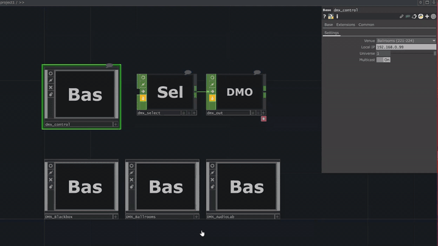

# NYU Media Commons — DMX Lighting Control

> A TouchDesigner-based DMX lighting control system for three performance spaces at NYU's **370 Jay Street Media Commons** — the **Ballrooms (221–224)**, the **Black Box (Room 220)**, and the **Audio Lab** — unified behind a single sACN (E1.31) output stage.



<sub>▶ [Watch full-quality video (22s)](https://github.com/DazaiStudio/nyu-mc-touchdesigner-template/releases/download/v0.1.0/mc-td-demo.mp4)</sub>

---

## About

The Media Commons hosts a wide mix of events — performances, film shoots, ballroom-scale gatherings, audio-visual installations, and teaching — each with very different lighting needs. Rather than maintain a separate show file per console per space, this project consolidates every fixture in the building into a single TouchDesigner template with per-space control panels and one consistent sACN output path.

It's designed to be **dropped in, configured once, and reused**: fixtures are pre-patched, modules are space-scoped, and the DMX output node is isolated at project level so it cooks reliably regardless of UI state.

**Scope of work** (authored and maintained by [Dazai](https://github.com/DazaiStudio)):
- TouchDesigner architecture, fixture modules (`.tox`), and sACN output pipeline
- DMX address patching across all three spaces (92 fixtures, 5 fixture types)
- Light plot diagrams, tech riders, and fixture documentation under [`docs/`](docs)
- Ongoing maintenance as rooms, fixtures, and event requirements change

---

## Spaces at a Glance

| Room | Space | Fixtures | Module |
|------|-------|----------|--------|
| 220 | Black Box | 22 (5 types) | [`DMX_Blackbox.tox`](mediacommons/DMX_Blackbox.tox) |
| 221–224 | Ballrooms | 50 (4 types) | [`DMX_Ballrooms.tox`](mediacommons/DMX_Ballrooms.tox) |
| — | Audio Lab | 8 (1 type) | [`DMX_AudioLab.tox`](mediacommons/DMX_AudioLab.tox) |

**Total: 80 fixtures across 3 spaces, all controllable from a single `.toe`.**

---

## Ballrooms 221–224

Four adjoining ballroom spaces sharing a fixture pool on **sACN Universe 1**. See [`docs/Light Plot - 370J MC Ballrooms 080625.pdf`](docs/Light%20Plot%20-%20370J%20MC%20Ballrooms%20080625.pdf) for rigging positions and DMX addresses.

| Fixture | Mode | Count | Channels | ID Range |
|---------|------|-------|----------|----------|
| Sixpar 300IP | 8-Ch | 16 | R, G, B, W, A, UV, Dim, **Strobe** | SP101–SP116 |
| ETC D22 LustrPlus | 9-Ch (Direct, Str Enabled) | 16 | R, W, A, G, C, B, I, Int, Strobe | D22_201–D22_216 |
| ETC Source 4WRD Color | 6-Ch | 12 | Int, R, G, B, A, Strobe | S4_301–S4_312 |
| Elation Unibar | 1-Ch (Dimmer) | 6 | Int | UB501–UB506 |

> ⚠️ **Sixpar Strobe gotcha** — channel 8 (Strobe) **must be `255`** for any light output. A default `0` reads as blackout, which is not obvious from the fixture's data sheet and cost hours to diagnose on install.

---

## Black Box (Room 220)

Standalone performance space with a denser, mixed-fixture rig. See [`docs/Light Plot - 370J MC BlackBox 080625.pdf`](docs/Light%20Plot%20-%20370J%20MC%20BlackBox%20080625.pdf).

| Fixture | Mode | Count | Fixture IDs |
|---------|------|-------|-------------|
| Sixpar 300IP | 8-Ch | 6 | 119–124 |
| ETC D22 LustrPlus | 9-Ch | 6 | 219–224 |
| ETC Source 4WRD Color | 6-Ch | 4 | 313–316 |
| Elation Unibar Dimmer | 1-Ch | 4 | 607–610 |
| Chauvet Ovation F-55FC | 13-Ch | 2 | 407–408 |

---

## Audio Lab

8× **Chauvet Ovation F-55FC** in **13-channel mode**. Full tech rider, light plot, patch-bay diagram, and console setup guides (ETC EOS / QLC+ / QLab) are in [`docs/Audio Lab - DMX Lighting Guide and Tech Rider.pdf`](docs/Audio%20Lab%20-%20DMX%20Lighting%20Guide%20and%20Tech%20Rider.pdf).

### Channel Map (13-Ch)

| Ch | Function | Ch | Function |
|----|----------|----|----------|
| 1  | Dimmer        | 8  | Blue fine     |
| 2  | Dimmer fine   | 9  | Amber         |
| 3  | Red           | 10 | Amber fine    |
| 4  | Red fine      | 11 | Lime          |
| 5  | Green         | 12 | Lime fine     |
| 6  | Green fine    | 13 | Strobe        |
| 7  | Blue          |    |               |

Strobe: `000–010` = off, `011–255` = slow → fast.

### Hardware Setup

The DMX patch panel sits in the **south-east corner of the live room**. Patch flow:
1. Pull fixtures into the DMX splitter via the patch bay
2. Link splitters together
3. Connect the DMX console to the splitter's input (green port)

The splitter cabinet is labeled **WR-FRONT** and is locked — ask an Audio Lab tech for the key.

---

## Architecture

```
┌─────────────────────────────────────────────────────────┐
│                    mediacommons.toe                      │
│                                                          │
│  ┌───────────────┐  ┌───────────────┐  ┌──────────────┐ │
│  │ DMX_Ballrooms │  │ DMX_Blackbox  │  │ DMX_AudioLab │ │
│  │  (fixtures +  │  │  (fixtures +  │  │  (fixtures + │ │
│  │   dmx_buffer) │  │   dmx_buffer) │  │   dmx_buffer)│ │
│  └───────┬───────┘  └───────┬───────┘  └───────┬──────┘ │
│          │                  │                  │        │
│          └──────────┬───────┴──────────────────┘        │
│                     ▼                                    │
│             ┌───────────────┐                            │
│             │  dmx_select   │  ← merge/route            │
│             └───────┬───────┘                            │
│                     ▼                                    │
│             ┌───────────────┐                            │
│             │  dmxoutCHOP   │  ← sACN out (project-level)│
│             └───────────────┘                            │
└─────────────────────────────────────────────────────────┘
                       │
                       ▼
              sACN Universe 1 → gateway @ 192.168.0.101
```

**Key design decision**: `dmxoutCHOP` lives at the project root, not inside a `baseCOMP`. Nested DMX outputs don't cook reliably in TD — the buffer goes stale when the parent COMP isn't visible. Keeping it at the top level guarantees a live DMX stream regardless of the UI state.

---

## Project Structure

```
.
├── mediacommons/
│   ├── mediacommons.toe        # Main TouchDesigner project
│   ├── DMX_Ballrooms.tox       # Ballrooms 221–224
│   ├── DMX_Blackbox.tox        # Black Box (Room 220)
│   ├── DMX_AudioLab.tox        # Audio Lab
│   └── Backup/                 # Local backups (git-ignored)
├── docs/
│   ├── Light Plot - 370J MC Ballrooms 080625.pdf
│   ├── Light Plot - 370J MC BlackBox 080625.pdf
│   └── Audio Lab - DMX Lighting Guide and Tech Rider.pdf
├── mc-td-demo.mp4              # Demo capture
└── README.md
```

## sACN / Network Configuration

| Setting | Value |
|---------|-------|
| Protocol | sACN / E1.31 |
| Universe | 1 (Ballrooms) — check per-module for others |
| Gateway IP | `192.168.0.101` |
| Local NIC | `192.168.0.234` |
| Output node | `dmxoutCHOP` at project root |

## Requirements

- [TouchDesigner](https://derivative.ca/) 2024.x or newer
- Network access to the sACN gateway on `192.168.0.0/24`
- Matching NIC configured on the control machine

## Usage

1. Open `mediacommons/mediacommons.toe`
2. Select the root-level `dmxout` CHOP and verify **Local Address** matches your NIC
3. Open the space-specific panel (Ballrooms / Black Box / Audio Lab)
4. Drive fixtures via the panel UI or wire your own CHOP sources into the `dmx_buffer`

---

## Credits

Maintained by **[Dazai](https://github.com/DazaiStudio)** — TouchDesigner integration, DMX patching, documentation, and ongoing rig maintenance.

Light plot drawings (Ballrooms & Black Box) produced in Vectorworks by **Tatsan Chen** (Aug 2025).

## License

MIT — see [LICENSE](LICENSE) if included; otherwise this project is provided as-is for reference and educational use.
